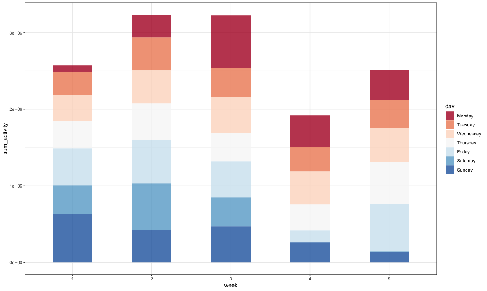
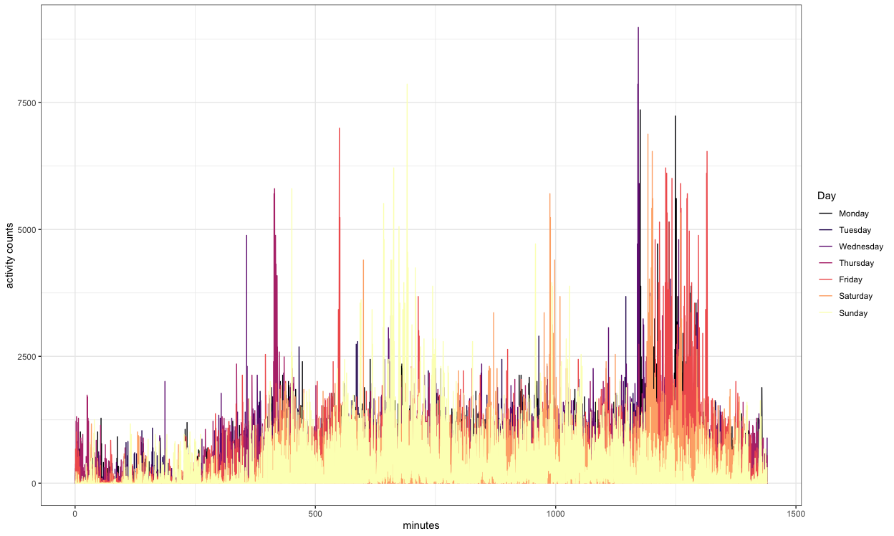

Homework 3
================
Mengyu Zhang
10/4/2019

# Problem 1

### Description of the datase

``` r
#load dataset
library(p8105.datasets)
data("instacart")

#primitive data structure
str(instacart)
```

    ## Classes 'tbl_df', 'tbl' and 'data.frame':    1384617 obs. of  15 variables:
    ##  $ order_id              : int  1 1 1 1 1 1 1 1 36 36 ...
    ##  $ product_id            : int  49302 11109 10246 49683 43633 13176 47209 22035 39612 19660 ...
    ##  $ add_to_cart_order     : int  1 2 3 4 5 6 7 8 1 2 ...
    ##  $ reordered             : int  1 1 0 0 1 0 0 1 0 1 ...
    ##  $ user_id               : int  112108 112108 112108 112108 112108 112108 112108 112108 79431 79431 ...
    ##  $ eval_set              : chr  "train" "train" "train" "train" ...
    ##  $ order_number          : int  4 4 4 4 4 4 4 4 23 23 ...
    ##  $ order_dow             : int  4 4 4 4 4 4 4 4 6 6 ...
    ##  $ order_hour_of_day     : int  10 10 10 10 10 10 10 10 18 18 ...
    ##  $ days_since_prior_order: int  9 9 9 9 9 9 9 9 30 30 ...
    ##  $ product_name          : chr  "Bulgarian Yogurt" "Organic 4% Milk Fat Whole Milk Cottage Cheese" "Organic Celery Hearts" "Cucumber Kirby" ...
    ##  $ aisle_id              : int  120 108 83 83 95 24 24 21 2 115 ...
    ##  $ department_id         : int  16 16 4 4 15 4 4 16 16 7 ...
    ##  $ aisle                 : chr  "yogurt" "other creams cheeses" "fresh vegetables" "fresh vegetables" ...
    ##  $ department            : chr  "dairy eggs" "dairy eggs" "produce" "produce" ...
    ##  - attr(*, "spec")=
    ##   .. cols(
    ##   ..   order_id = col_integer(),
    ##   ..   product_id = col_integer(),
    ##   ..   add_to_cart_order = col_integer(),
    ##   ..   reordered = col_integer(),
    ##   ..   user_id = col_integer(),
    ##   ..   eval_set = col_character(),
    ##   ..   order_number = col_integer(),
    ##   ..   order_dow = col_integer(),
    ##   ..   order_hour_of_day = col_integer(),
    ##   ..   days_since_prior_order = col_integer(),
    ##   ..   product_name = col_character(),
    ##   ..   aisle_id = col_integer(),
    ##   ..   department_id = col_integer(),
    ##   ..   aisle = col_character(),
    ##   ..   department = col_character()
    ##   .. )

The size of the data is 1384617 observations of 15 variables. The
primitive data structures are integer and character, and the
non-primitive data structure is list. Key variables include the
information of the orders like order\_id, add\_to\_cart\_order,
reordered, order\_number, order\_dow, order\_hour\_of\_day,
days\_since\_prior\_order and the information of users like and the
informaiton of products like product\_id, product\_name, aisle\_id,
aisle, department\_id, department.

### Answer the questions

  - How many aisles are there, and which aisles are the most items
    ordered from?

There are 134 aisles and “fresh vegetables” is the most items ordered
from, and the number of order is 150609.

``` r
#the number of aisles
knitr::kable(instacart %>%
  summarize(
  n_aisles = n_distinct(aisle)
  ))
```

| n\_aisles |
| --------: |
|       134 |

``` r
#aisles that the most items ordered from
knitr::kable(instacart %>%
  group_by(aisle) %>%
  summarize(n_obs = n()) %>% 
  filter(min_rank(desc(n_obs)) == 1))
```

| aisle            | n\_obs |
| :--------------- | -----: |
| fresh vegetables | 150609 |

  - Make a plot that shows the number of items ordered in each aisle,
    limiting this to aisles with more than 10000 items ordered. Arrange
    aisles sensibly, and organize your plot so others can read it.

<!-- end list -->

``` r
# scatterplot for the number of items ordered in each aisle
instacart %>%
  group_by(aisle) %>%
  summarize(n_obs = n()) %>% 
  filter(n_obs > 10000) %>% 
  ggplot(aes(x = aisle, y = sort(n_obs))) + 
  geom_point(size = 2) + 
  labs(
    title = "The Number of Items Ordered in each Aisle",
    x = "Aisle Name",
    y = "The number of items"
  ) + 
  theme_bw() + 
  theme(axis.text.x = element_text(size = 9, vjust = 0.5, hjust = 0.5, angle = 45))
```

<!-- -->

  - Make a table showing the three most popular items in each of the
    aisles “baking ingredients”, “dog food care”, and “packaged
    vegetables fruits”. Include the number of times each item is ordered
    in your table.

<!-- end list -->

``` r
three_pop_item = instacart %>%
  filter(aisle == "baking ingredients" | aisle == "dog food care" | aisle == "packaged vegetables fruits") %>% 
  group_by(aisle, product_name) %>%
  summarize(n_obs = n()) %>% 
  ungroup() %>% 
  group_by(aisle) %>% 
  filter(min_rank(desc(n_obs)) < 4) 

knitr::kable(three_pop_item)
```

| aisle                      | product\_name                                 | n\_obs |
| :------------------------- | :-------------------------------------------- | -----: |
| baking ingredients         | Cane Sugar                                    |    336 |
| baking ingredients         | Light Brown Sugar                             |    499 |
| baking ingredients         | Pure Baking Soda                              |    387 |
| dog food care              | Organix Chicken & Brown Rice Recipe           |     28 |
| dog food care              | Small Dog Biscuits                            |     26 |
| dog food care              | Snack Sticks Chicken & Rice Recipe Dog Treats |     30 |
| packaged vegetables fruits | Organic Baby Spinach                          |   9784 |
| packaged vegetables fruits | Organic Blueberries                           |   4966 |
| packaged vegetables fruits | Organic Raspberries                           |   5546 |

  - Make a table showing the mean hour of the day at which Pink Lady
    Apples and Coffee Ice Cream are ordered on each day of the week;
    format this table for human readers (i.e. produce a 2 x 7 table).

<!-- end list -->

``` r
# table showing the mean hour of the day
mean_hod_dow = instacart %>%
  filter(product_name == "Pink Lady Apples" | product_name == "Coffee Ice Cream") %>% 
  group_by(product_name, order_dow) %>% 
  summarise(mean_hod = mean(order_hour_of_day)) %>% 
  pivot_wider(
    names_from = order_dow,
    values_from = mean_hod
  )

knitr::kable(mean_hod_dow, digits = 3)
```

| product\_name    |      0 |      1 |      2 |      3 |      4 |      5 |      6 |
| :--------------- | -----: | -----: | -----: | -----: | -----: | -----: | -----: |
| Coffee Ice Cream | 13.774 | 14.316 | 15.381 | 15.318 | 15.217 | 12.263 | 13.833 |
| Pink Lady Apples | 13.441 | 11.360 | 11.702 | 14.250 | 11.552 | 12.784 | 11.938 |

# Problem 2

### Import data

First, do some data cleaning:

  - format the data to use appropriate variable names;
  - focus on the “Overall Health” topic
  - include only responses from “Excellent” to “Poor”
  - organize responses as a factor taking levels ordered from “Poor” to
    “Excellent”

<!-- end list -->

``` r
#clean data
brfss = brfss_smart2010 %>% 
  janitor::clean_names() %>%
  filter(topic == "Overall Health", 
         response == "Excellent" | 
           response == "Very good" | 
           response == "Good" | 
           response == "Fair" | 
           response == "Poor") %>% 
  mutate(
    response = factor(
      response, 
      levels = c("Poor", "Fair", "Good", "Very good", "Excellent")
      )
    )
```

Using this dataset, do or answer the following (commenting on the
results of each):

  - In 2002, which states were observed at 7 or more locations? What
    about in 2010?

In 2002 we can see there are 6 states were observed at 7 or more
locations shown as table 1, and in 2010, there are 14 states were
observed at 7 or more locations shown as table 2.

**Comment:** the increasing number of observed locations shows that
BRFSS has become a powerful tool for targeting and building health
promotion activities. The benefits of this system have been brought to
society, like addressing urgent and emerging health issue.

``` r
# in 2002
knitr::kable(
    brfss %>% 
      filter(year == 2002) %>% 
      group_by(locationabbr) %>% 
      summarise(n_location = n_distinct(locationdesc)) %>% 
      filter(n_location >= 7),
    caption = "Table 1: In 2002, 6 states were observed at 7 or more locations"
  )
```

| locationabbr | n\_location |
| :----------- | ----------: |
| CT           |           7 |
| FL           |           7 |
| MA           |           8 |
| NC           |           7 |
| NJ           |           8 |
| PA           |          10 |

Table 1: In 2002, 6 states were observed at 7 or more locations

``` r
#in 2010
knitr::kable(
    brfss %>% 
      filter(year == 2010) %>% 
      group_by(locationabbr) %>% 
      summarise(n_location = n_distinct(locationdesc)) %>% 
      filter(n_location >= 7),
    caption = "Table 2: In 2010, 14 states were observed at 7 or more locations"
  )
```

| locationabbr | n\_location |
| :----------- | ----------: |
| CA           |          12 |
| CO           |           7 |
| FL           |          41 |
| MA           |           9 |
| MD           |          12 |
| NC           |          12 |
| NE           |          10 |
| NJ           |          19 |
| NY           |           9 |
| OH           |           8 |
| PA           |           7 |
| SC           |           7 |
| TX           |          16 |
| WA           |          10 |

Table 2: In 2010, 14 states were observed at 7 or more locations

  - Construct a dataset that is limited to Excellent responses, and
    contains, year, state, and a variable that averages the data\_value
    across locations within a state. Make a “spaghetti” plot of this
    average value over time within a state (that is, make a plot showing
    a line for each state across years – the geom\_line geometry and
    group aesthetic will help).

**Comment:**

``` r
# construct the dataset
mean_data_value = brfss %>% 
  filter(response == "Excellent") %>% 
  group_by(year, locationabbr) %>% 
  summarize(mean_data_value = mean(data_value, na.rm = TRUE)) %>% 
  rename(state = locationabbr)  # change variable name

#knitr::kable(mean_data_value)

# “spaghetti” plot
mean_data_value %>% 
  ggplot(aes(x = year, y = mean_data_value)) +
  geom_line(aes(color = state)) + 
  scale_color_viridis(discrete=TRUE) + 
  labs(
    title = "Mean data value over time within a state",
    y = "Mean Data Value"
  ) + 
  theme_bw()
```

<!-- -->

  - Make a two-panel plot showing, for the years 2006, and 2010,
    distribution of data\_value for responses (“Poor” to “Excellent”)
    among locations in NY State.

**Comment:**

``` r
brfss%>% 
  filter(year == 2006 | year == 2010, 
         locationabbr == "NY") %>% 
  select(year, locationdesc, response, data_value) %>% 
  mutate(locationdesc = forcats::fct_reorder(locationdesc, year, median)) %>%
  ggplot(aes(x = response, y = data_value)) + 
  geom_point() + 
  facet_grid(year ~ locationdesc)
```

<!-- -->

``` r
brfss%>% 
  filter(year == 2006 | year == 2010, 
         locationabbr == "NY") %>% 
  select(year, locationdesc, response, data_value) %>% 
  ggplot(aes(x = response, y = data_value)) + 
  geom_point(aes(color = locationdesc), size = 5, alpha=.6) + 
  facet_grid(.~year) + 
  scale_color_viridis(name = "Locations in NY state", discrete=TRUE)
```

<!-- -->

# Problem 3

  - Load, tidy, and otherwise wrangle the data. Your final dataset
    should include all originally observed variables and values; have
    useful variable names; include a weekday vs weekend variable; and
    **encode data with reasonable variable classes**. Describe the
    resulting dataset (e.g. what variables exist, how many observations,
    etc).

<!-- end list -->

``` r
accel_data = read_csv("data/accel_data.csv") %>% 
  janitor::clean_names() %>% 
  mutate(day_index = recode(day, 
                            "Monday" = "Weekday", 
                            "Tuesday" = "Weekday", 
                            "Wednesday" = "Weekday", 
                            "Thursday" = "Weekday", 
                            "Friday" = "Weekday", 
                            "Saturday" = "Weekend", 
                            "Sunday" = "Weekend"),
         day_encoded = recode(day, 
                              "Monday" = 1, 
                              "Tuesday" = 2, 
                              "Wednesday" = 3, 
                              "Thursday" = 4, 
                              "Friday" = 5, 
                              "Saturday" = 6, 
                              "Sunday" = 7),
         week = factor(week)
         ) %>% 
  arrange(week, day_encoded) %>% 
  pivot_longer(
    activity_1:activity_1440,
    names_prefix = "activity_",
    names_to = "minutes",
    values_to = "activity_counts")
```

    ## Parsed with column specification:
    ## cols(
    ##   .default = col_double(),
    ##   day = col_character()
    ## )

    ## See spec(...) for full column specifications.

**Description:** the size of resulting dataset is 50400 observations of
7 variables which are week, day\_id, day, day\_index, day\_encoded for
the information of day, minutes for every minute in each day and
activity\_counts.

  - Traditional analyses of accelerometer data focus on the total
    activity over the day. Using your tidied dataset, aggregate accross
    minutes to create a total activity variable for each day, and create
    a table showing these totals. Are any trends apparent?

There is no trend apparent based on the line plot.

``` r
accel_data %>% 
  group_by(week, day_encoded) %>% 
  summarise(sum_activity=sum(activity_counts)) %>% 
  arrange(week, day_encoded) %>% 
  ggplot(aes(x= day_encoded, y = sum_activity, fill = week)) + 
  geom_line(aes(color = week), size = 2) + 
  scale_color_viridis(discrete=TRUE)
```

<!-- -->

  - Accelerometer data allows the inspection activity over the course of
    the day. Make a single-panel plot that shows the 24-hour activity
    time courses for each day and use color to indicate day of the week.
    Describe in words any patterns or conclusions you can make based on
    this gra

<!-- end list -->

``` r
accel_data %>% 
  #filter(week == 1) %>% 
  ggplot(aes(x= as.numeric(minutes), y = activity_counts, fill = day)) + 
  geom_line(aes(color = day)) +
  labs(
    x = "minutes",
    y = "activity counts"
  ) + 
  scale_color_viridis(option = "magma", discrete=TRUE)
```

<!-- -->
